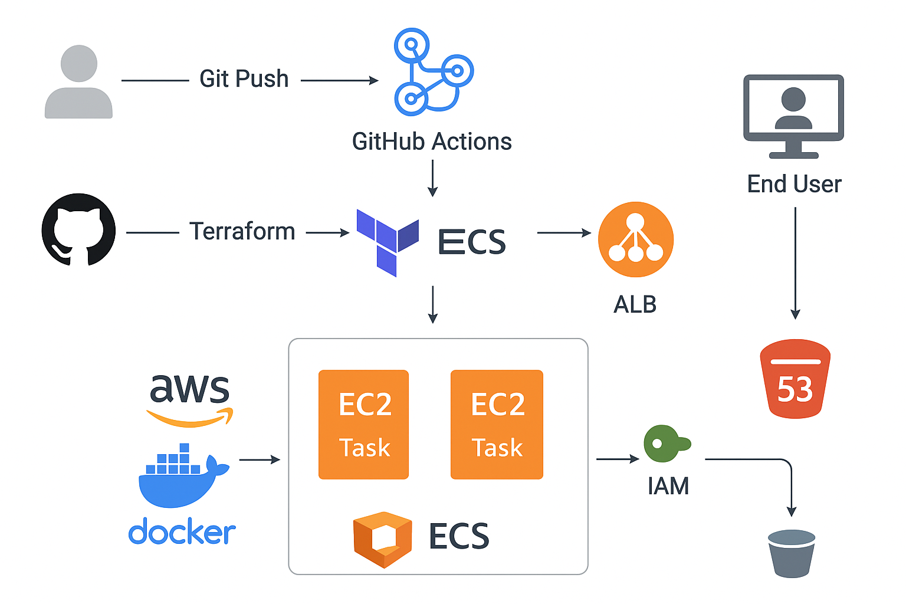

🏗️ Infrastructure Workflow
1.	Networking
	Creates VPC, subnets (public/private), Internet Gateway, NAT Gateway, and routing.
2.	Compute
	Provisions 2 EC2 instances to be used as ECS container instances.
3.	ECS Cluster
	Sets up ECS Cluster.
	Registers task definitions and services for Threat Composer.
4.	ECR
	Creates Elastic Container Registry for storing Docker images.
5.	ALB
	Deploys Application Load Balancer with listeners and target groups.
	ECS services are attached behind ALB.
6.	IAM
	Configures roles for ECS tasks, EC2 instances, and GitHub Actions pipeline.
7.	Route 53
	Sets up DNS record for friendly domain access.
________________________________________
⚙️ CI/CD Pipeline (GitHub Actions)
Workflow: .github/workflows/ecstf.yaml
Jobs
•	Terraform
	Initialize, validate, plan, and apply Terraform configuration.
	Remote state stored in S3 backend.
•	Docker Build & Push
	Build Docker image for Threat Composer app.
	Push image to ECR repository.
•	ECS Deploy
	Update ECS task definition with the new image.
	Restart ECS service to deploy the latest version.
________________________________________
🌐 Deployment Flow
1.	Developer pushes code → GitHub Actions triggers.
2.	Terraform job provisions/updates infrastructure on AWS.
3.	Docker job builds and pushes container image to ECR.
4.	ECS job updates running service on ECS cluster.
5.	Application is accessible via ALB DNS / Route53 custom domain.
________________________________________
📊 Tech Stack
•	AWS: ECS, EC2, ECR, VPC, ALB, IAM, Route53, S3 (remote state)
•	Terraform: Modular IaC
•	GitHub Actions: CI/CD automation
•	Docker: Containerized application
